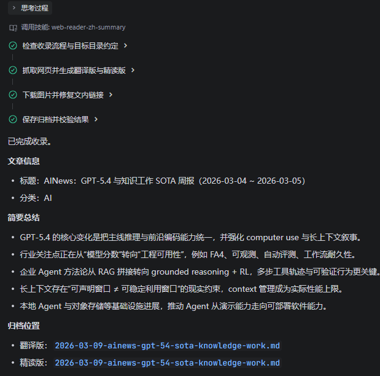
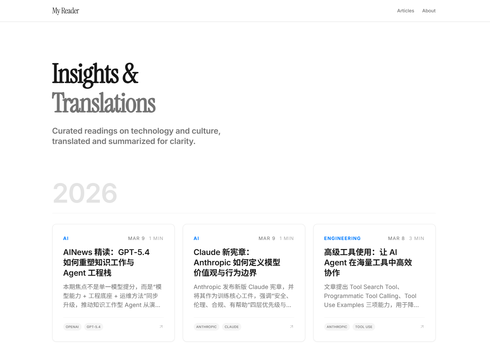
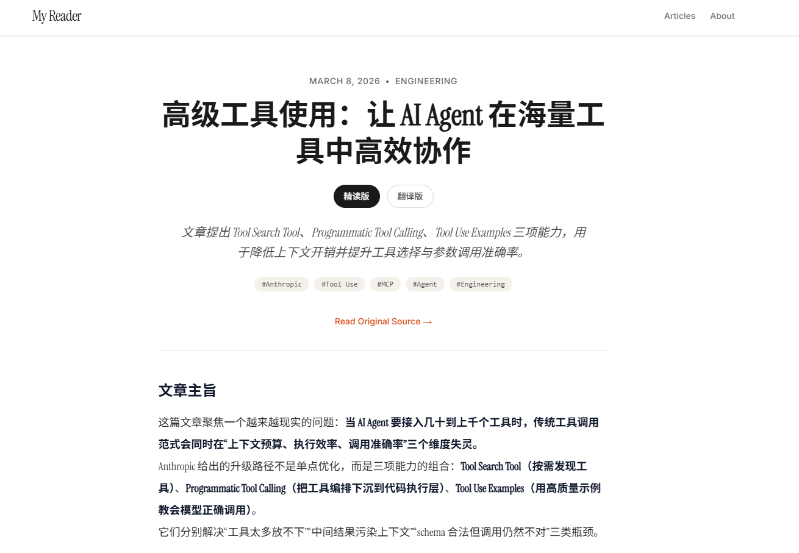

# MyReader：基于 LLM 的 Web Blog 阅读助手

> 通过技能编排，将“网页阅读 → 结构化输出 → 网页端回看”串成一条可复用链路。

## 项目概述

MyReader 面向“长网页快速理解”场景，用户输入提示词并提供网页链接后，系统自动完成内容读取与摘要整理，并生成可直接复用的阅读产出。

核心输出包含：

- 归纳总结版  
- 完整翻译版  
- 精读增强版  

## 目标与价值

- 降低长文阅读成本，提升信息获取效率  
- 提供多粒度输出，适配不同阅读深度需求  
- 用技能组件封装流程，便于在不同 Agent 体系中迁移复用  

## Demo 流程

### 1) 输入 Prompt 与目标网页

### 2) 生成结构化文档结果

### 3) 网页端查看结果

### 4) 点击卡片查看详细内容

## 工程总结

该项目验证了技能化编排在内容处理类任务中的可行性：同一套能力可以脱离单一实现环境，在不同 Coding Agent 中复现并落地。

## 开源地址

[Vonct/myReader](https://github.com/Vonct/myReader)
