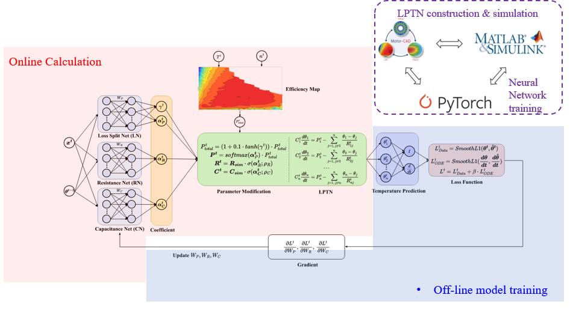
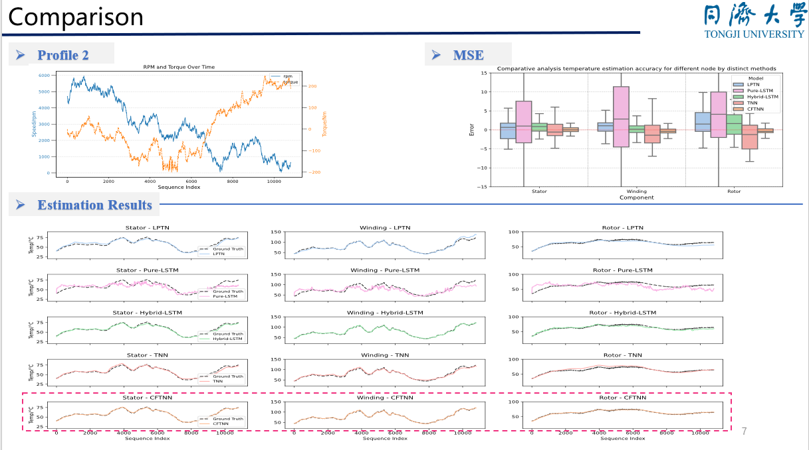
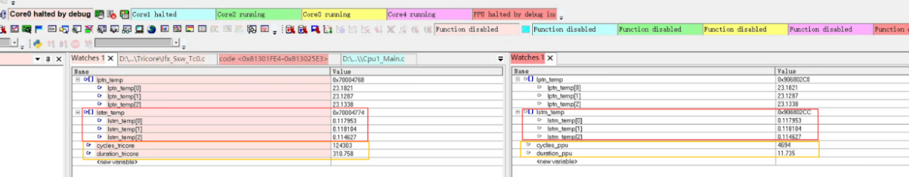
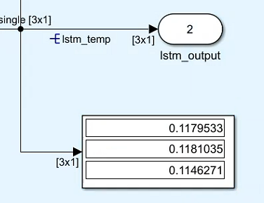
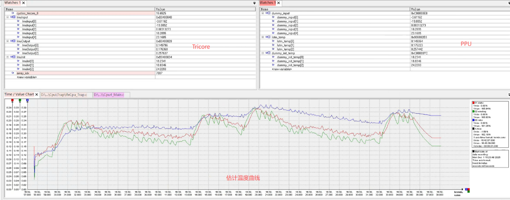
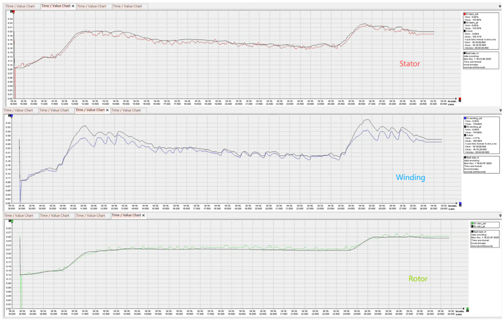

# PMSM 电机温度估计与实时部署

> 以更少的模型复杂度，换取更高的工程可用性与实时性能。

## 项目概述

面向高功率密度永磁同步电机（PMSM），本项目聚焦在线温度估计与车规部署可行性。  
目标是在保证精度的同时，让算法能够稳定运行在量产控制硬件上。

## 为什么要做

- 功率密度持续提升，电机内部热场变化更快、更复杂。  
- 过热会引发绕组绝缘风险与永磁体退磁风险。  
- 温度估计不仅用于保护，也用于在线修正控制参数，提升整体控制精度。  

## 核心方法

采用“低阶 LPTN + 神经网络校正”的混合方案：

- 使用低阶 LPTN 提供基础热状态建模能力。  
- 使用神经网络校正功率损耗与热参数偏差。  
- 通过数据驱动捕捉时变工况，提升估计精度与泛化表现。  

## 部署路径

- 通过工具链生成代码，完成 PPU 编译与烧录。  
- 算法分别部署在 Tricore 与 PPU 平台。  
- 在相同运行条件下对比 Simulink 仿真与实机执行结果。  

## 实验结果

- 仿真结果与部署测试结果保持一致。  
- 在单次计算耗时维度，PPU 显著优于 Tricore。  
- 综合评估显示，PPU 端计算速度提升约 28 倍。  

## 结论

该方案在“可解释性、精度、实时性”之间取得平衡，适合继续向工程化温度管理模块推进。
